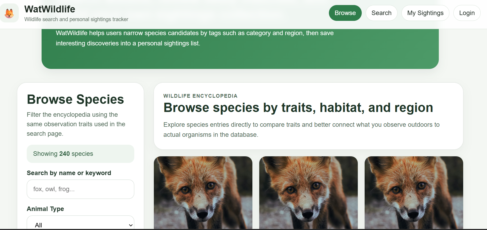
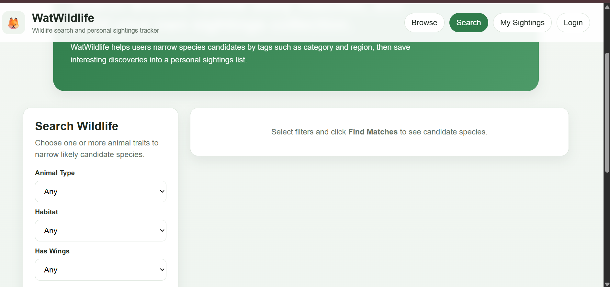
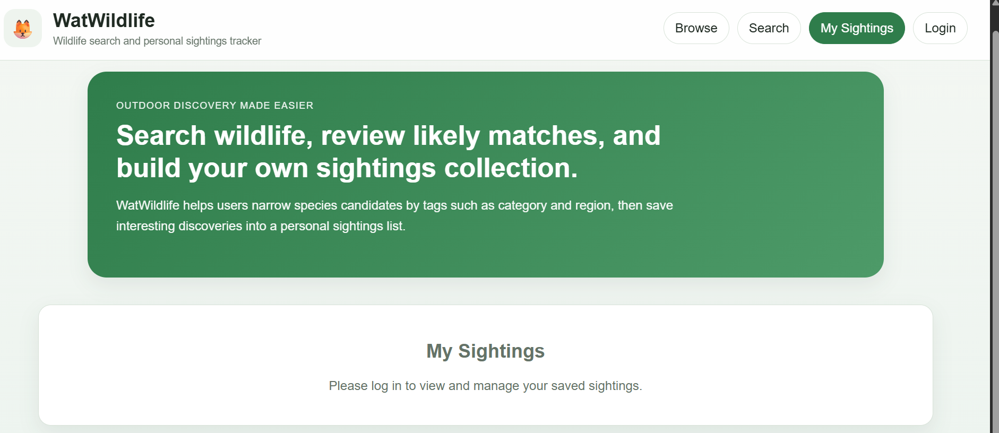
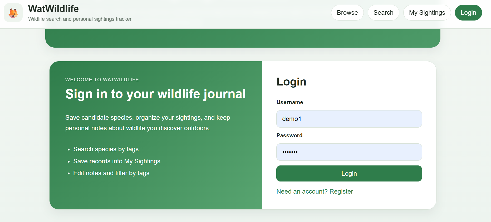

# WatWildlife

## Authors
- Ruotian Zhang
- Alptug Guven

## Class Link
https://johnguerra.co/classes/webDevelopment_online_spring_2026/

## Project Name
WatWildlife

## Project Objective
WatWildlife is a full-stack wildlife identification and sighting tracking web application for hikers, explorers, and nature enthusiasts. Users can search for likely matching wildlife species by filtering observation traits such as animal type, habitat, wings, tail type, number of legs, size, color, and region. Users can also save and manage their own sightings, while administrators can manage the species encyclopedia by creating, editing, and deleting species entries.

The goal of the project is to make wildlife discovery more approachable by combining:
- a searchable wildlife encyclopedia
- a candidate-matching search experience
- a personal sightings tracker with authentication

## Design Document
Please refer to:
[Design Document on Google Doc](https://docs.google.com/document/d/1vYnra4bTlV29P2OLqSaK0bk7P75pFIvQBhvHDgEEUAo/edit?tab=t.0)

## Google Slides
Please refer to:
[Introduction on Google Slides](https://docs.google.com/presentation/d/1-p7JDoJz50qN2YJ79GG_FZ4DKbWAXe_EPhGu2KlFoHQ/edit?slide=id.g3c89cae159e_0_129#slide=id.g3c89cae159e_0_129)

## Project Links
- GitHub repository: https://github.com/fifthfir/CS5610-Proj3
- Deployment: https://cs5610-proj3.onrender.com/

## Key Features
- Browse a wildlife encyclopedia of species entries
- Filter species by traits such as subtype, habitat, size, color, and region
- View species details in a dedicated modal
- Search for likely wildlife matches using observation filters
- Register and log in as a user
- Save candidate species to My Sightings
- View and manage personal saved sightings
- Admin-only species management for create, edit, and delete operations

## Screenshots





## Instructions to Build and Run Locally

### 1. Clone the repository
```bash
git clone https://github.com/fifthfir/CS5610-Proj3.git
cd CS5610-Proj3